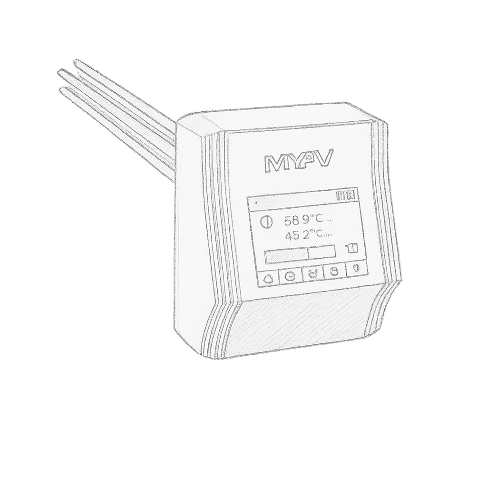

# ioBroker.ac-elwa-2

[](https://www.npmjs.com/package/iobroker.ac-elwa-2)
[](https://www.npmjs.com/package/iobroker.ac-elwa-2)


[](https://nodei.co/npm/iobroker.ac-elwa-2/)

**Tests:** 

## ac-elwa-2 adapter for ioBroker

Query the status info of AC ELWA 2.

## Developer manual

### DISCLAIMER

This library is not affiliated with MyPv. It is an independent project developed to provide tools for interacting with AC ELWA 2 featuring integrated web interface. Any trademarks or product names mentioned are the property of their respective owners.

### Scripts in `package.json`

Several npm scripts are predefined for your convenience. You can run them using `npm run <scriptname>`
| Script name | Description |
|-------------|-------------|
| `test:js` | Executes the tests you defined in `*.test.js` files. |
| `test:package` | Ensures your `package.json` and `io-package.json` are valid. |
| `test:integration` | Tests the adapter startup with an actual instance of ioBroker. |
| `test` | Performs a minimal test run on package files and your tests. |
| `check` | Performs a type-check on your code (without compiling anything). |
| `lint` | Runs `ESLint` to check your code for formatting errors and potential bugs. |
| `translate` | Translates texts in your adapter to all required languages, see [`@iobroker/adapter-dev`](https://github.com/ioBroker/adapter-dev#manage-translations) for more details. |
| `release` | Creates a new release, see [`@alcalzone/release-script`](https://github.com/AlCalzone/release-script#usage) for more details. |

### Publishing the adapter

Using GitHub Actions, you can enable automatic releases on npm whenever you push a new git tag that matches the form
`v<major>.<minor>.<patch>`. We **strongly recommend** that you do. The necessary steps are described in `.github/workflows/test-and-release.yml`.

Since you installed the release script, you can create a new
release simply by calling:

```bash
npm run release <releaseType> -- --dry
```

releaseType: major, minor, patch, prerelease

Additional command line options for the release script are explained in the
[release-script documentation](https://github.com/AlCalzone/release-script#command-line).

To get your adapter released in ioBroker, please refer to the documentation
of [ioBroker.repositories](https://github.com/ioBroker/ioBroker.repositories#requirements-for-adapter-to-get-added-to-the-latest-repository).

### Test the adapter manually with dev-server

Since you set up `dev-server`, you can use it to run, test and debug your adapter.

You may start `dev-server` by calling from your dev directory:

```bash
dev-server watch
```

The ioBroker.admin interface will then be available at http://localhost:8081/

Please refer to the [`dev-server` documentation](https://github.com/ioBroker/dev-server#command-line) for more details.

## Changelog

<!--
    Placeholder for the next version (at the beginning of the line):
    ### **WORK IN PROGRESS**
-->

### 0.0.2 (2025-09-05)

- (mr-suw) preview release which polls JSON data to ioBroker

## License

MIT License

Copyright (c) 2025 mr-suw <mrsuw@icloud.com>

Permission is hereby granted, free of charge, to any person obtaining a copy
of this software and associated documentation files (the "Software"), to deal
in the Software without restriction, including without limitation the rights
to use, copy, modify, merge, publish, distribute, sublicense, and/or sell
copies of the Software, and to permit persons to whom the Software is
furnished to do so, subject to the following conditions:

The above copyright notice and this permission notice shall be included in all
copies or substantial portions of the Software.

THE SOFTWARE IS PROVIDED "AS IS", WITHOUT WARRANTY OF ANY KIND, EXPRESS OR
IMPLIED, INCLUDING BUT NOT LIMITED TO THE WARRANTIES OF MERCHANTABILITY,
FITNESS FOR A PARTICULAR PURPOSE AND NONINFRINGEMENT. IN NO EVENT SHALL THE
AUTHORS OR COPYRIGHT HOLDERS BE LIABLE FOR ANY CLAIM, DAMAGES OR OTHER
LIABILITY, WHETHER IN AN ACTION OF CONTRACT, TORT OR OTHERWISE, ARISING FROM,
OUT OF OR IN CONNECTION WITH THE SOFTWARE OR THE USE OR OTHER DEALINGS IN THE
SOFTWARE.
